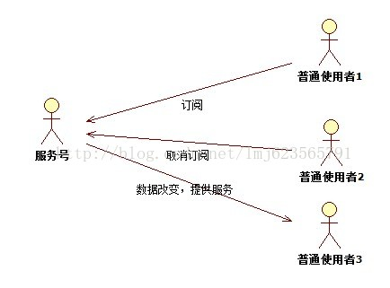

**设计模式（Design pattern）是一套被反复使用、多数人知晓的、经过分类编目的、代码设计经验的总结。**

设计模式分为三种类型，共23种：

创建型模式：单例模式、抽象工厂模式、建造者模式、工厂模式、原型模式。

结构型模式：适配器模式、桥接模式、装饰模式、组合模式、外观模式、享元模式、代理模式。

行为型模式：模版方法模式、命令模式、迭代器模式、观察者模式、中介者模式、备忘录模式、解释器模式、状态模式、策略模式、责任链模式、访问者模式。

####观察者模式
意义：对象之间的一对多的依赖，这样一来，当一个对象改变时，它的所有的依赖者都会收到通知并自动更新。



```text
含义：
观察者模式是一种对象行为模式。它定义对象间的一种一对多的依赖关系，当一个对象的状态发生改变时，所有依赖于它的对象都得到通知并被自动更新。
在观察者模式中，主体是通知的发布者，它发出通知时并不需要知道谁是它的观察者，可以有任意数目的观察者订阅并接收通知。

也就是当被观察者状态变化时，通知所有观察者，这种依赖方式具有双向性，在QQ邮箱中的邮件订阅和RSS订阅，当我们浏览一些博客时，经常会看到RSS图标，
意思就是，当你订阅了该文章，如果后续有更新，会及时通知你。这种现象即是典型的观察者模式。再举个例子，用户界面可以作为一个观察者，业务数据是被观察者，
用户界面观察业务数据的变化，发现数据变化后，就显示在界面上。

优点：
观察者模式（Observer）完美的将观察者和被观察的对象分离开。观察者模式在模块之间划定了清晰的界限，提高了应用程序的可维护性和重用性。
面向对象设计的一个原则是：系统中的每个类将重点放在某一个功能上，而不是其他方面。一个对象只做一件事情，并且将他做好。

适用场景：
观察者模式不仅被广泛应用于软件界面元素之间的交互，在业务对象之间的交互、权限管理等方面也有广泛的应用。

```

设计模式 观察者模式(Observer Pattern) 以微信公众服务为例

当然了java中已经帮我们实现了观察者模式，借助于java.util.Observable和java.util.Observer。

可以看出，使用Java内置的类实现观察者模式，代码非常简洁，对了addObserver,removeObserver,notifyObservers都已经为我们

实现了，所有可以看出Observable（主题）是一个类，而不是一个接口，基本上书上都对于Java的如此设计抱有反面的态度，

觉得Java内置的观察者模式，违法了面向接口编程这个原则，但是如果转念想一想，的确你拿一个主题在这写观察者模式（我们自己的实现），

接口的思想很好，但是如果现在继续添加很多个主题，每个主题的ddObserver,removeObserver,notifyObservers代码基本都是相同的吧，

接口是无法实现代码复用的，而且也没有办法使用组合的模式实现这三个方法的复用，所以我觉得这里把这三个方法在类中实现是合理的。

####工厂模式

工厂家族:

1、静态工厂模式

这个最常见了，项目中的辅助类，TextUtil.isEmpty等，类+静态方法。下面开始详细介绍：略。

2、简单工厂模式

3、工厂方法模式

4、抽象工厂模式

